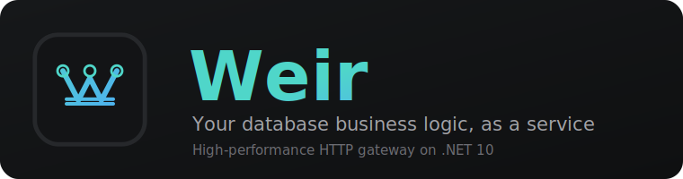

<p align="center">
  
</p>

<p align="center"><a href="README.md">English</a> | Russkiy</p>

<p align="center">
  <a href="https://github.com/jrfrigat/weir/actions/workflows/ci.yml"></a>
  <a href="LICENSE"></a>
  
</p>

# Weir

**Weir** - это тонкий высокопроизводительный HTTP-шлюз над MSSQL (в дальнейшем и над другими
СУБД): клиент вызывает эндпоинт, Weir вызывает **хранимую процедуру или функцию** и отдаёт
результат в виде JSON. Никакой бизнес-логики на C# - только маршрутизация, аутентификация,
маппинг параметров, кеширование, телеметрия и сериализация.

## Принципы

- **Только хранимые процедуры / функции.** Weir никогда не выполняет произвольный SQL.
- **Управление через метаданные.** Эндпоинты описываются как метаданные и управляются из
  PWA-админки - добавить или изменить эндпоинт можно без передеплоя.
- **Тонко и быстро.** ASP.NET Core Minimal API, Dapper, наборы строк стримятся напрямую из
  DbDataReader в JSON-ответ. Никакого ORM и лишних аллокаций на горячем пути.
- **Мультиконнект.** Один инстанс маршрутизирует на много серверов / БД / схем одновременно
  через именованные подключения. Драйверы data-plane поставляются отдельными пакетами -
  подключается только нужное.
- **Наблюдаемость.** Метрики и трейсы OpenTelemetry, структурированное файловое логирование Serilog с
  retention, плюс встроенный in-memory агрегатор, который питает real-time (SignalR) дашборд в админке.
- **Управляемость.** Настройки рантайма (лимиты data-plane, rate-limit, retention аудита) правятся из
  админ-панели без перезапуска; каждое действие админа аудируется; сессии админов отзываемы; админка -
  устанавливаемое PWA.

## Две плоскости

| Плоскость | Ответственность | Хранилище |
|-----------|-----------------|-----------|
| **Data plane** | Горячий путь: auth, биндинг параметров, вызов SP, стриминг JSON | Целевые БД (MSSQL) |
| **Control plane** | Собственные метаданные Weir: эндпоинты, API-ключи, скоупы, админы, аудит, настройки | Отдельное хранилище (SQLite или PostgreSQL; через абстракцию провайдера) |

## Структура решения

```
src/
  Weir.Contracts/            DTO и enum, общие для хоста и админки (browser-safe)
  Weir.Abstractions/         Серверные порты: IDbConnector, IControlPlaneStore, телеметрия, кеш
  Weir.Core/                 Движок: резолв эндпоинтов, биндинг, стриминг JSON, кеш
  Weir.Diagnostics/          Телеметрия: ActivitySource, Meter, in-memory агрегатор метрик
  Weir.ControlPlane.Sqlite/  Стор control-plane по умолчанию (плюс idempotent-миграции)
  Weir.ControlPlane.PostgreSql/  Общий стор control-plane для развёртываний с высокой доступностью
  connectors/
    Weir.Connectors.SqlServer/    IDbConnector для SQL Server (Microsoft.Data.SqlClient + Dapper)
    Weir.Connectors.PostgreSql/   IDbConnector для PostgreSQL (Npgsql)
  Weir.Host/                 Хост ASP.NET Core: динамические роуты, API-key auth, admin API, отдача PWA
  Weir.Admin/                Blazor WASM PWA админка и дашборд (на Flare)
tests/
docs/                        документация en/ и ru/, плюс adr/
build/                       Dockerfile, CI
samples/                     Примеры хранимых процедур и сид метаданных
```

## Контракт API (кратко)

**Запрос** - плоское тело JSON равно параметрам хранимой процедуры; TVP - это массивы объектов.
Кеширование настраивается на стороне сервера для каждого эндпоинта (TTL плюс набор входных
параметров, формирующих ключ).

```http
POST /api/orders/create
X-Api-Key: wk_live_9f3a...
Content-Type: application/json

{ "customerId": 42, "items": [ { "sku": "A1", "qty": 2 } ] }
```

**Ответ** - единый конверт. "data" - это массив наборов строк (массив массивов);
"messages" несёт SQL PRINT / info-сообщения.

```json
{
  "data": [ [ { "id": 1001, "status": "created" } ] ],
  "output": { "newOrderId": 1001, "totalCount": 57 },
  "returnValue": 0,
  "rowsAffected": 1,
  "messages": [ { "text": "Order created", "severity": 0, "number": 50000, "line": 12 } ]
}
```

Ошибки используют **RFC 7807** application/problem+json.

## Документация

Полная документация - в **[docs/](docs/README.md)** (английский и русский):

| Документ | Описание |
| :-- | :-- |
| [Начало работы](docs/ru/getting-started.md) | Запуск Weir, настройка подключения, первый эндпоинт |
| [Архитектура](docs/ru/architecture.md) | Две плоскости, карта модулей, жизненный цикл запроса |
| [Эндпоинты и контракт API](docs/ru/endpoints.md) | Параметры, TVP, конверт запроса/ответа |
| [Безопасность](docs/ru/security.md) | API-ключи и скоупы, аккаунты админов и JWT |
| [Конфигурация](docs/ru/configuration.md) | Все настройки и переменные окружения |
| [Деплой](docs/ru/deployment.md) | Docker-образ и docker-compose |
| [Админка](docs/ru/admin-ui.md) | Дашборд и страницы управления |

## Установка

Из релиза (запушенного тега `v*`) поставляется две вещи:

**Docker-образ** - всё приложение (хост + PWA-админка), в GitHub Container Registry:

```sh
docker pull ghcr.io/jrfrigat/weir:latest      # или закреплённый тег :X.Y.Z
docker run -p 8080:8080 \
  -e Weir__DataConnections__default__ConnectionString="Server=...;Database=...;User Id=...;Password=...;TrustServerCertificate=True" \
  -e Weir__Admin__Username=admin -e Weir__Admin__Password=a-strong-password \
  -e Weir__Jwt__SigningKey=a-stable-secret \
  ghcr.io/jrfrigat/weir:latest
# Откройте http://localhost:8080
```

Тома, compose и высокую доступность см. в [Деплое](docs/ru/deployment.md).

**NuGet-библиотеки** - нужны, только если вы собираете собственный хост или свой data-plane коннектор
(большинству достаточно просто запустить образ). Публикуются на NuGet.org: `Weir.Contracts`,
`Weir.Abstractions`, `Weir.Core`, `Weir.Diagnostics`, `Weir.ControlPlane.Sqlite`,
`Weir.ControlPlane.PostgreSql`, `Weir.Connectors.SqlServer`, `Weir.Connectors.PostgreSql`.

```sh
dotnet add package Weir.Abstractions   # реализуйте IDbConnector / IControlPlaneStore поверх портов
```

Как написать коннектор или плагин - см. [Расширение](docs/ru/extending.md).

## Сборка и запуск

```sh
dotnet build
dotnet test
dotnet run --project src/Weir.Host
```

Требуется SDK **.NET 10**. Или запустите Weir в Docker (он подключается к вашему SQL Server; compose его не поднимает):

```sh
docker compose up -d --build   # Windows: run-docker-compose.bat
# Откройте http://localhost:8080
```

## Контрибьютинг и безопасность

- [CONTRIBUTING.md](CONTRIBUTING.md) - сборка, конвенции, workflow
- [SECURITY.md](SECURITY.md) - сообщение об уязвимостях
- [CHANGELOG.md](CHANGELOG.md) - заметки о релизах

## Благодарности

PWA-админка построена на [Flare](https://github.com/jrfrigat/Flare) - theme-agnostic
Blazor-библиотеке компонентов (тема Visual Studio 2026).

## Лицензия

[MIT](LICENSE) (c) 2026 FrigaT
